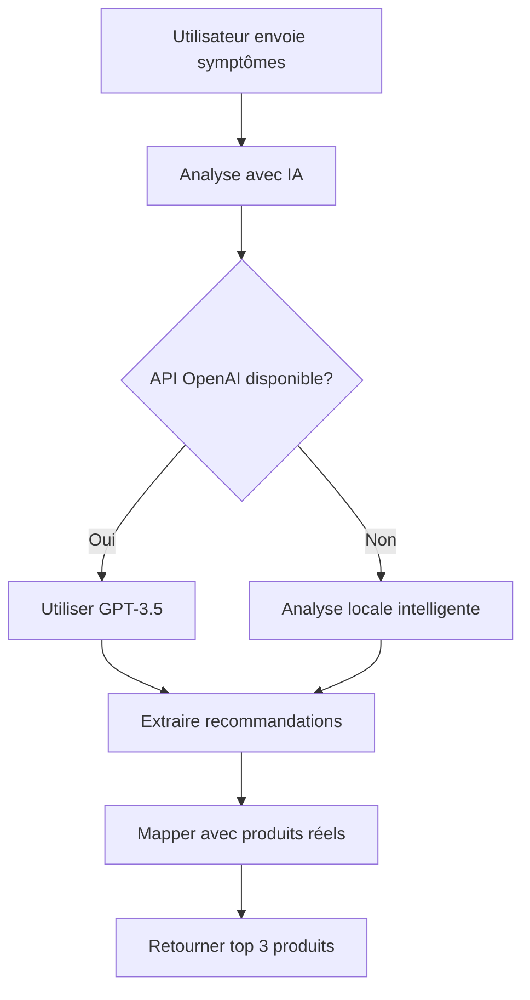
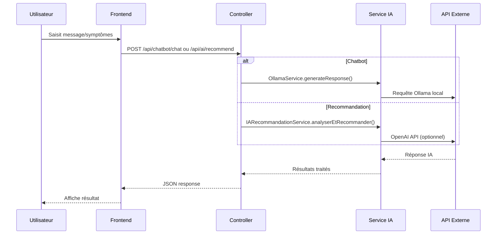

# AI Assistant - CURAVITA

Ce document décrit l'assistant IA utilisé dans l'application CURAVITA.

## Vue d'ensemble

CURAVITA dispose de plusieurs assistants IA pour différentes fonctionnalités :

| Assistant | Service | Description |
|-----------|---------|-------------|
| **Chatbot** | [`OllamaService`](src/Service/OllamaService.php) | Assistant conversationnel local (Llama3) |
| **Recommandation** | [`IARecommandationService`](src/Service/IARecommandationService.php) | Recommande des produits selon les symptômes |
| **Assistant Admin** | [`GroqLlmService`](src/Service/GroqLlmService.php) | Aide les admins à analyser les tickets |

---

## 1. Chatbot (Ollama - Local)

### Contrôleur
[`ChatbotController`](src/Controller/ChatbotController.php)

### Routes API
- `GET /api/chatbot/status` - Vérifie si Ollama est disponible
- `GET /api/chatbot/is-new` - Vérifie si l'utilisateur est nouveau
- `POST /api/chatbot/mark-seen` - Marque l'introduction comme vue
- `POST /api/chatbot/chat` - Envoie un message au chatbot

### Service
[`OllamaService`](src/Service/OllamaService.php)

### Caractéristiques
- **Modèle** : Llama3 (local)
- **URL** : `http://127.0.0.1:11434`
- **Personnalité** : Assistant pharmacy amical et énergétique
- **Langue** : Français

---

## 2. Recommandation de Produits

### Contrôleur
[`AIController`](src/Controller/AIController.php)

### Route API
```
POST /api/ai/recommend
```

### Service
[`IARecommandationService`](src/Service/IARecommandationService.php)

### Logique de recommandation



### Fonctionnalités
- Analyse des symptômes (tête, gorge, fièvre, douleur, etc.)
- Correspondance avec les produits du catalogue
- Score de pertinence (0-100)
- Fallback local si pas d'accès API externe

---

## 3. Assistant Admin (Groq)

### Contrôleur
[`AssistantChatController`](src/Controller/AssistantChatController.php)

### Route API
```
POST /api/assistant/chat
```

### Service
[`GroqLlmService`](src/Service/GroqLlmService.php)

### Caractéristiques
- **Modèle** : Groq LLM (API externe)
- **Domaine** : Aide pharmaceutique et support CURAVITA
- **Règles** : Toujours inclure un avertissement médical

---

## 4. Services IA Disponibles

| Service | Fichier | Usage |
|---------|---------|-------|
| [`OllamaService`](src/Service/OllamaService.php) | Chatbot conversationnel |
| [`IARecommandationService`](src/Service/IARecommandationService.php) | Recommandations produits |
| [`IAInteractionMedicamenteuse`](src/Service/IAInteractionMedicamenteuse.php) | Détection interactions médicamenteuses |
| [`IADosageService`](src/Service/IADosageService.php) | Conseils dosages |
| [`IAAnalyseNoteMedicaleService`](src/Service/IAAnalyseNoteMedicaleService.php) | Analyse notes médicales |
| [`StockAIService`](src/Service/StockAIService.php) | Prédictions stock |
| [`StockAssistantService`](src/Service/StockAssistantService.php) | Assistant stock |

---

## Flux Utilisation



---

## Configuration

### Variables d'environnement
```env
# Ollama (Local)
OLLAMA_URL=http://127.0.0.1:11434
OLLAMA_MODEL=llama3

# OpenAI (Optionnel)
OPENAI_API_KEY=sk-...

# Groq (Optionnel)
GROQ_API_KEY=gsk_...
```

### Prérequis
- **Ollama** : Doit être installé localement sur le serveur
- **API Keys** : Optionnelles pour fonctionnalités avancées
