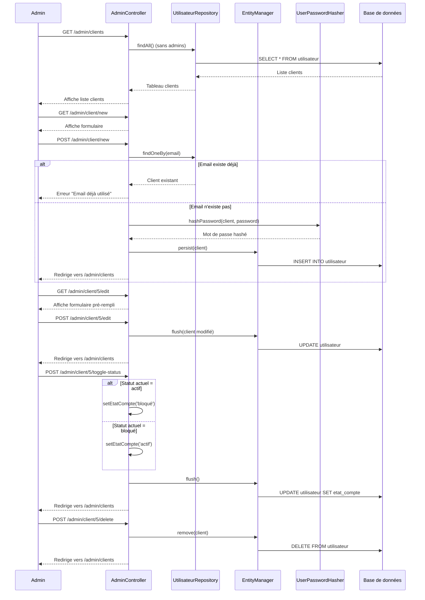

# CRUD - Gestion des Clients (Admin Dashboard)

Ce document décrit les opérations CRUD (Create, Read, Update, Delete) pour la gestion des clients dans le tableau de bord administrateur CURAVITA.

## Vue d'ensemble des Routes

| Opération | Route | Méthode | Controller |
|-----------|-------|---------|------------|
| **Read (List)** | `/admin/clients` | GET | [`AdminController::clients()`](src/Controller/AdminController.php:229) |
| **Create** | `/admin/client/new` | GET/POST | [`AdminController::newClient()`](src/Controller/AdminController.php:300) |
| **Update** | `/admin/client/{id}/edit` | GET/POST | [`AdminController::editClient()`](src/Controller/AdminController.php:385) |
| **Delete** | `/admin/client/{id}/delete` | POST | [`AdminController::deleteClient()`](src/Controller/AdminController.php:452) |
| **Toggle Status** | `/admin/client/{id}/toggle-status` | POST | [`AdminController::toggleClientStatus()`](src/Controller/AdminController.php:370) |

---

## 1. READ - Liste des Clients

### Route
```
GET /admin/clients
```

### Fonctionnement ([`AdminController.php:229-290`](src/Controller/AdminController.php:229))

```php
#[Route('/admin/clients', name: 'admin_clients')]
public function clients(UtilisateurRepository $utilisateurRepository, Request $request): Response
```

### Logique :
1. Récupère tous les utilisateurs qui n'ont pas le rôle `ROLE_ADMIN`
2. Applique les filtres de recherche (par nom, prénom, email)
3. Trie les résultats (par défaut, par date de création)
4. Retourne la vue `Admin/clients/index.html.twig`

### Paramètres de requête :
- `search` : Recherche par nom, prénom ou email
- `role` : Filtrer par rôle (client, assistant)
- `sort` : Trier (alpha, date_asc, date_desc)

---

## 2. CREATE - Créer un Nouveau Client

### Route
```
GET /admin/client/new  → Formulaire
POST /admin/client/new → Traitement
```

### Fonctionnement ([`AdminController.php:300-368`](src/Controller/AdminController.php:300))

```php
#[Route('/admin/client/new', name: 'admin_client_new', methods: ['GET', 'POST'])]
public function newClient(
    Request $request, 
    EntityManagerInterface $entityManager, 
    UserPasswordHasherInterface $passwordHasher, 
    UtilisateurRepository $utilisateurRepository
): Response
```

### Logique :
1. **GET** : Affiche le formulaire de création (`Admin/clients/new.html.twig`)
2. **POST** : Traite les données soumises
   - Valide que l'email n'existe pas déjà
   - Crée un nouvel objet `Utilisateur`
   - Hash le mot de passe avec bcrypt
   - Définit le rôle (client ou assistant)
   - Sauvegarde en base de données

### Données requises :
| Champ | Type | Description |
|-------|------|-------------|
| `nom` | string | Nom du client |
| `prenom` | string | Prénom du client |
| `email` | string | Email unique |
| `password` | string | Mot de passe (hashé) |
| `telephone` | string | Numéro de téléphone |
| `role` | string | Rôle (client/assistant) |

---

## 3. UPDATE - Modifier un Client

### Route
```
GET /admin/client/{id}/edit  → Formulaire
POST /admin/client/{id}/edit → Traitement
```

### Fonctionnement ([`AdminController.php:385-449`](src/Controller/AdminController.php:385))

```php
#[Route('/admin/client/{id}/edit', name: 'admin_client_edit', methods: ['GET', 'POST'])]
public function editClient(
    Utilisateur $client, 
    Request $request, 
    EntityManagerInterface $entityManager, 
    UserPasswordHasherInterface $passwordHasher
): Response
```

### Logique :
1. **GET** : Affiche le formulaire pré-rempli (`Admin/clients/edit.html.twig`)
2. **POST** : Met à jour les données
   - Modifie les informations personnelles
   - Met à jour le rôle si nécessaire
   - Change le mot de passe si fourni
   - Modifie le statut du compte

### Champs modifiables :
- Nom, Prénom, Email, Téléphone
- Rôle (client/assistant)
- Mot de passe (optionnel)
- État du compte (actif/bloqué)

---

## 4. DELETE - Supprimer un Client

### Route
```
POST /admin/client/{id}/delete
```

### Fonctionnement ([`AdminController.php:452-461`](src/Controller/AdminController.php:452))

```php
#[Route('/admin/client/{id}/delete', name: 'admin_client_delete', methods: ['POST'])]
public function deleteClient(
    Utilisateur $client, 
    EntityManagerInterface $entityManager
): Response
```

### Logique :
1. Supprime définitivement le client de la base de données
2. Redirige vers la liste des clients avec un message de succès

### Sécurité :
- Suppression via requête POST (protection CSRF)
- Liquid ORM gère la suppression

---

## 5. TOGGLE STATUS - Activer/Bloquer un Client

### Route
```
POST /admin/client/{id}/toggle-status
```

### Fonctionnement ([`AdminController.php:370-383`](src/Controller/AdminController.php:370))

```php
#[Route('/admin/client/{id}/toggle-status', name: 'admin_client_toggle_status', methods: ['POST'])]
public function toggleClientStatus(
    Utilisateur $client, 
    EntityManagerInterface $entityManager
): Response
```

### Logique :
1. Inverse le statut du compte (actif ↔ bloqué)
2. Sauvegarde en base de données
3. Redirige vers la liste avec un message de succès

### Statuts possibles :
- `actif` : Client peut se connecter
- `bloqué` : Client ne peut pas se connecter

---

## Diagramme de Séquence



---

## Entité Utilisateur

### Propriétés utilisées pour le CRUD client :

| Propriété | Type | Description |
|-----------|------|-------------|
| `id_utilisateur` | int | ID unique (PK) |
| `nom` | string | Nom de famille |
| `prenom` | string | Prénom |
| `email` | string | Email unique |
| `mot_de_passe` | string | Mot de passe hashé |
| `telephone` | string | Numéro de téléphone |
| `roles` | json | Rôles (ROLE_USER, ROLE_ADMIN, etc.) |
| `etat_compte` | string | Statut (actif/bloqué) |
| `date_creation` | datetime | Date de création |

---

## Sécurité

1. **Accès restreint** : Toutes les routes admin nécessitent `ROLE_ADMIN`
2. **CSRF Protection** : Formulaires protégés avec tokens CSRF
3. **Validation** : Validation des données côté serveur
4. **Hashage** : Mots de passe hashés avec bcrypt
