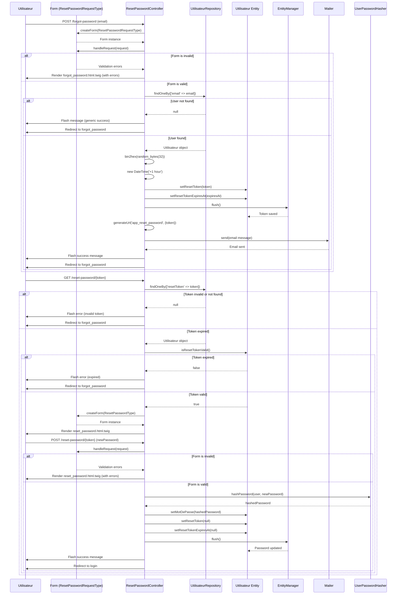

# Diagramme de Séquence - Mot de Passe Oublié

## Vue d'ensemble

Ce diagramme de séquence décrit le processus complet de réinitialisation du mot de passe dans l'application CURAVITA.

## Détails des composants

### Contrôleurs
- **[`ResetPasswordController`](src/Controller/ResetPasswordController.php)**: Gère les deux routes du processus
  - `app_forgot_password` (ligne 23): Demande de réinitialisation
  - `app_reset_password` (ligne 89): Réinitialisation effective

### Formulaires
- **[`ResetPasswordRequestType`](src/Form/ResetPasswordRequestType.php)**: Formulaire de demande d'email
  - Champ: email (avec validation)
  
- **[`ResetPasswordType`](src/Form/ResetPasswordType.php)**: Formulaire de nouveau mot de passe
  - Champ: newPassword (RepeatedType avec confirmation)

### Entités
- **[`Utilisateur`](src/Entity/Utilisateur.php)**: Entité utilisateur
  - `resetToken` (ligne 67): Token de réinitialisation
  - `resetTokenExpiresAt` (ligne 70): Date d'expiration du token
  - `isResetTokenValid()` (ligne 317): Méthode de validation du token

## Flux détaillé

### Étape 1: Demande de réinitialisation
1. L'utilisateur saisit son adresse email
2. Le formulaire est validé (email obligatoire et format valide)
3. Le système génère un token cryptographique sécurisé (32 bytes)
4. Le token est associé à l'utilisateur avec une expiration de 1 heure
5. Un email contenant le lien de réinitialisation est envoyé
6. Un message générique est affiché (pour éviter l'énumération d'emails)

### Étape 2: Réinitialisation du mot de passe
1. L'utilisateur clique sur le lien dans l'email
2. Le système vérifie la validité du token
3. Si valide, le formulaire de nouveau mot de passe est affiché
4. L'utilisateur saisit et confirme son nouveau mot de passe
5. Le mot de passe est hashé avec bcrypt
6. L'ancien token est invalidé
7. L'utilisateur est redirigé vers la page de connexion

## Considérations de sécurité

- **Protection contre l'énumération**: Un message générique est toujours affiché
- **Expiration du token**: Le token expire après 1 heure
- **Hashage du mot de passe**: Utilisation de bcrypt via Symfony
- **Invalidation automatique**: Le token est supprimé après utilisation
